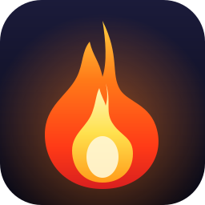

<div align="center">



# 🔥 Bombers Test — Generalitat de Catalunya

### L'app d'estudi definitiva per a les oposicions de **Bombers de la Generalitat de Catalunya**

Practica els **21 temes** del temari, supera **exàmens oficials simulats** i repassa els teus errors fins a clavar-los. Tot en una app d'escriptori, ràpida i **100 % offline**.

🟢 **Codi obert (open source) i totalment gratuït.** Si vols que el projecte segueixi viu i actualitzat, [fes una donació](#-suport-al-projecte). 💛

<br>


</div>

---

## ✨ Característiques

- 🎯 **315 preguntes** tipus test en català (21 temes × 15), amb resposta correcta i **explicació** a cadascuna.
- 📚 **Tests per tema** amb nivells desbloquejables, sistema de **punts**, **estrelles** ⭐ i temporitzador.
- 📝 **Exàmens oficials simulats**: 4 exàmens de bloc + **Examen Final** dels 21 temes (50 preguntes).
- 🔁 **Repàs de preguntes fallades**: les que falles s'acumulen i les pots repassar fins a dominar-les.
- 📊 **Estadístiques detallades** del teu progrés, amb consells dels temes més fluixos.
- 🎉 Feedback immediat, confeti i animacions de foc quan superes un test.
- 🎨 Disseny **"Tactical Ember"**: fosc, modern i professional, amb tipografia robusta i fons real de Bombers de Catalunya.
- 💾 **Offline total** i progrés guardat automàticament al teu equip.

---

## 📖 Temari cobert (Bases 81/18)

<details>
<summary><b>Desplega els 21 temes</b></summary>

| # | Tema | # | Tema |
|---|------|---|------|
| 1 | Constitució espanyola i Estatut | 12 | Mecànica de vehicles |
| 2 | Personal de les administracions | 13 | Prevenció i protecció contra incendis |
| 3 | Llei 31/1995 de prevenció de riscos laborals | 14 | Atenció sanitària (primers auxilis) |
| 4 | Llei 5/1994 SPEIS i Llei 4/1997 PC | 15 | Construcció: materials |
| 5 | Física | 16 | Construcció: estructures |
| 6 | Física del foc | 17 | Electricitat |
| 7 | Agents extintors | 18 | Cartografia |
| 8 | Mecànica | 19 | Geografia física |
| 9 | Química | 20 | Coneixement del territori català |
| 10 | Risc químic (MATPEL) | 21 | Meteorologia |
| 11 | Hidràulica | | |

</details>

---

## 🚀 Descàrrega i instal·lació (Windows)

Descarrega l'última versió des de la secció **[Releases](https://github.com/FurneDesigns/bombers-catalunya/releases)**:

| Format | Fitxer | Per a qui |
|--------|--------|-----------|
| 🪟 **Instal·lador** | `Bombers Test ... Setup 1.0.0.exe` | Recomanat — crea accés directe i entrada al menú d'inici |
| 📦 **Portable** | `Bombers Test ... 1.0.0.exe` | Un sol fitxer, sense instal·lació. Doble clic i llest |

> No necessita connexió a internet ni cap dependència. Compatible amb Windows 10/11 (x64).

---

## 🛠️ Desenvolupament

```bash
# Clona el repositori
git clone git@github.com:FurneDesigns/bombers-catalunya.git
cd bombers-catalunya

# Instal·la dependències
npm install

# Executa en mode desenvolupament
npm start

# Compila per a Windows
npm run build            # → EXE portable
npm run build-installer  # → instal·lador NSIS
# (sortida a la carpeta dist/)
```

**Stack:** [Electron](https://www.electronjs.org/) 28 · HTML/CSS/JS vanilla (zero frameworks) · [electron-builder](https://www.electron.build/). Tipografies **Oswald** + **Inter** integrades. Les preguntes viuen a [`src/data/questions.json`](src/data/questions.json).

---

## 💛 Suport al projecte

Aquest projecte és **open source** i **gratuït** — i ho seguirà sent. Però mantenir-lo viu (afegir preguntes, actualitzar el temari, corregir errades i treure noves versions) requereix moltes hores de feina.

**Si vols que el projecte continuï i segueixi creixent, considera fer una donació.** Cada aportació, per petita que sigui, ajuda directament a que això tiri endavant. ☕🔥

- 💳 **PayPal:** [paypal.me/furnedesigns](https://paypal.me/furnedesigns)
- 📱 **Bizum:** `+34 635 165 846`
- ✉️ **Contacte:** [support@furnedesigns.com](mailto:support@furnedesigns.com)

Gràcies de tot cor! 💛

---

## 🙏 Crèdits

- **Desenvolupament i disseny:** [FurneDesigns](https://furnedesigns.com)
- **Fotografia de fons:** *Bombers de Catalunya a l'Escala* — © [Javierito92](https://commons.wikimedia.org/wiki/File:Bombers_de_Catalunya_a_l%27Escala.jpg), [CC BY 3.0](https://creativecommons.org/licenses/by/3.0)
- **Tipografies:** Oswald i Inter (SIL Open Font License)

Vegeu [CREDITS.md](CREDITS.md) per als detalls complets.

---

## 📄 Llicència

Codi sota llicència [MIT](LICENSE). Els actius (foto, tipografies) mantenen les seves llicències respectives.

> ⚠️ Projecte fet per FurneDesigns com a eina d'estudi. No està vinculat ni avalat oficialment per Bombers de la Generalitat de Catalunya.

<div align="center">

**Fet amb ❤️ i 🔥 per [FurneDesigns](https://furnedesigns.com) · Molta sort a l'oposició! 🚒**

</div>
